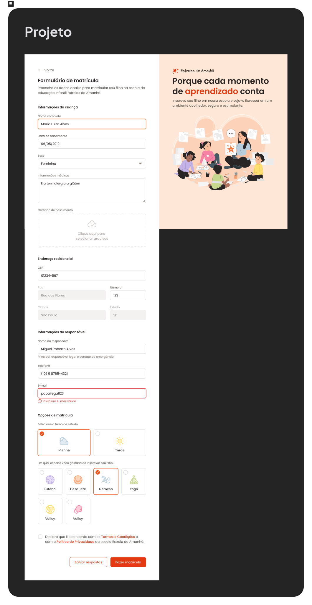

# Formulário de Matrícula

O projeto **Estrelas do Amanhã** é uma página de matrícula escolar infantil desenvolvida para praticar conceitos avançados de HTML5 e CSS3.

---

##  Link do Projeto
<a href="https://jftigre.github.io/FormularioDeMatricula/FormularioDeMatricula/" target="_blank">**[Clique aqui para ver o site no ar]**</a>

---

##  Preview do Projeto

  

---

##  Tecnologias Utilizadas
- **HTML5**: Estrutura semântica com foco em acessibilidade.
- **CSS3**: Layout com Flexbox, variáveis e componentes customizados.
- **SVG**: Ícones e ilustrações leves e escaláveis.

---
